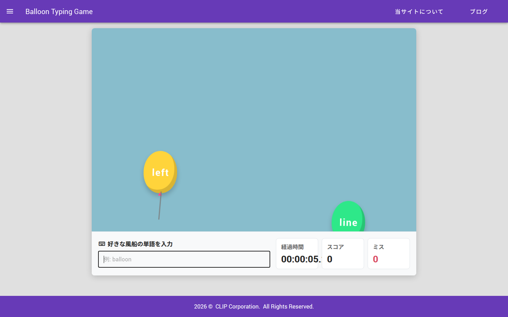
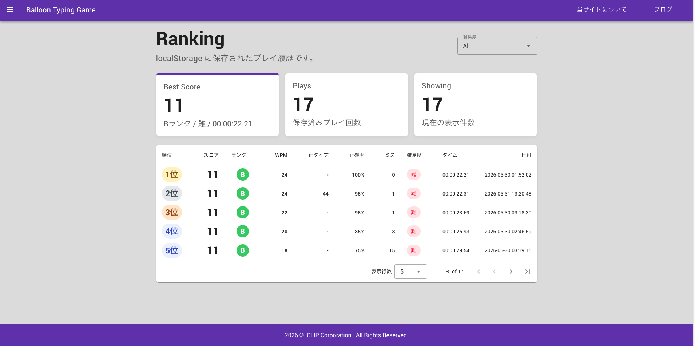
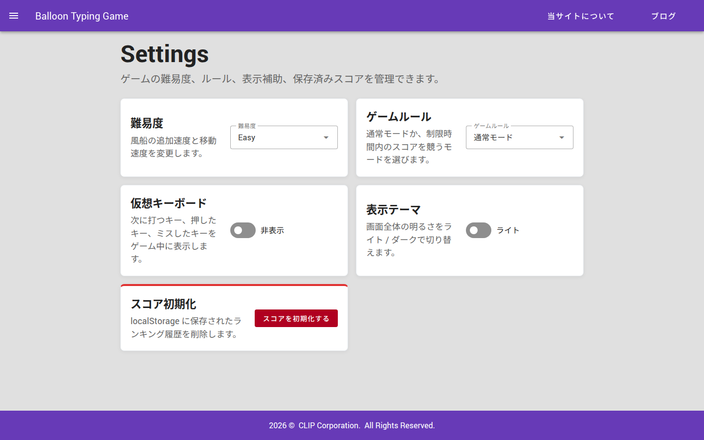
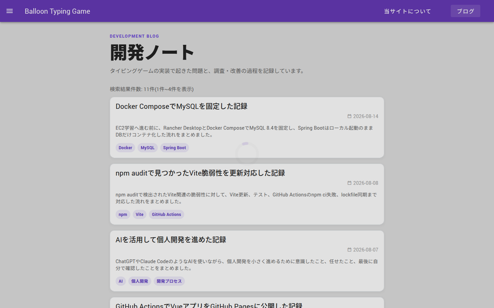
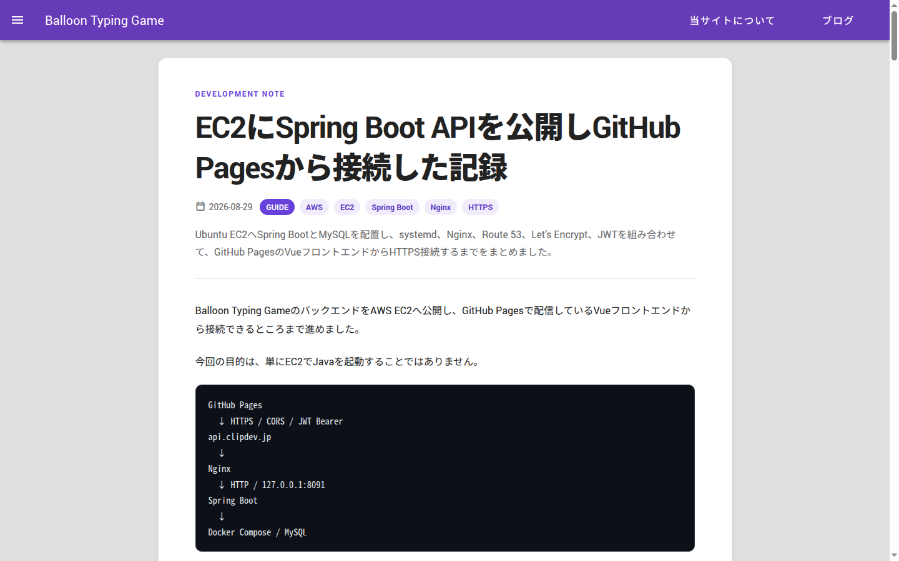
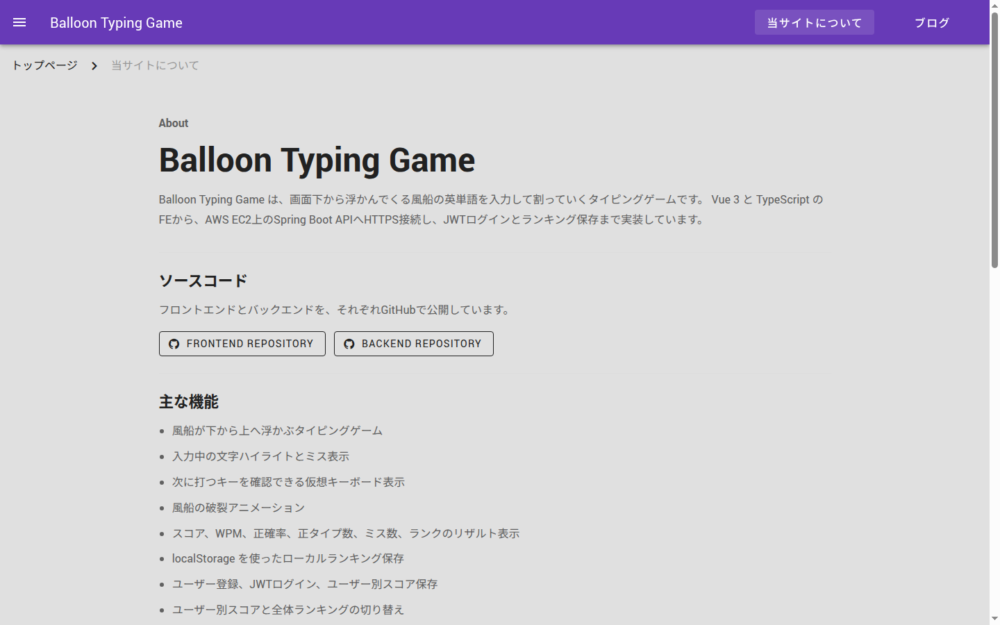

# Balloon Typing Game

Vue 3 + TypeScript で作成した、風船を割っていくタイピングゲームです。

画面下から浮かび上がる風船型の単語を入力し、正しく打てると風船が破裂してスコアが加算されます。

## Demo

[https://juju351nicu.github.io/typingGame/](https://juju351nicu.github.io/typingGame/)

## Screenshots

### Game



### Result and Ranking



### Settings



### Blog





### About



## Features

- 画面下から浮かぶ風船型の単語表示
- タイピング入力の正誤判定
- 入力中の文字ハイライト
- ミス入力時の強調表示
- 正解時の風船破裂アニメーション
- スコア表示
- リザルト画面
- WPM / 正確率 / ミス数の表示
- 正タイプ数の表示
- リトライ
- 学習補助用の仮想キーボード表示
- localStorage を使ったランキング表示
- 難易度設定
- スコア履歴の localStorage 保存・初期化
- Markdown ブログ記事の一覧・詳細表示
- ブログ記事詳細の前後ナビゲーション
- スマホ表示対応
- GitHub Actions による test / build / deploy 自動化

## How to Play

1. デモURL、またはローカル環境でゲームを開きます。
2. `Play` ボタンを押してゲームを開始します。
3. 画面に表示される風船の単語を入力します。
4. 正しく入力すると風船が破裂し、スコアが加算されます。
5. 風船が画面上部まで到達するとゲーム終了です。
6. リザルト画面の `リトライ` ボタンから再挑戦できます。
7. 仮想キーボードは設定画面から任意で表示できます。

## Tech Stack

- Vue 3
- TypeScript
- Vite
- Vue Router
- Pinia
- pinia-plugin-persistedstate
- Vuetify
- Vitest
- GitHub Actions
- GitHub Pages

## Highlights

- `setInterval` のタイマーIDを管理し、多重起動を防止
- `stopTimers` を導入し、画面遷移やゲーム終了時にタイマーを確実に停止
- GitHub Pages のベースパスに対応し、公開環境でのページ遷移エラーを修正
- macOS と Linux のファイル名大文字小文字差異による build エラーを修正
- Pinia と localStorage を使い、設定とスコアを保持
- CSS アニメーションで、風船の浮遊と破裂演出を実装
- 入力中の風船を強調し、正しい文字・ミス文字を視覚的に判別しやすく改善
- ミス入力時に入力欄と風船へ短いフィードバックアニメーションを追加
- 仮想キーボードで次に打つキー、押したキー、ミスしたキーを任意表示
- リザルト画面で WPM / 正確率 / 正タイプ数 / ミス数 / ランクを表示
- ランキング画面でスコア、ランク、WPM、正確率、正タイプ数、ミス数、難易度、タイムを比較可能に改善
- 設定画面で難易度と仮想キーボード表示を変更可能
- Markdown ブログ詳細に、posts_index.json の順序を基準にした前後記事ナビを追加
- スコア初期化前に確認ダイアログを表示し、誤操作で履歴を消しにくいように改善
- スマホ幅でもゲーム画面、リザルト画面、ランキング画面が見やすいようにレスポンシブ調整
- Vitest で 13 ファイル / 56 テストを実装し、タイピング処理、ブログ前後ナビ、スコア初期化、localStorage 復元処理などを検証

## Component Design

`TypingPanel.vue` に集まっていたゲーム処理を、Composition API の composable として責務ごとに分離しています。

| ファイル | 役割 |
| --- | --- |
| `useBlogPostNavigation.ts` | ブログ記事詳細の前後ナビゲーション判定 |
| `useCompletedWordHandler.ts` | 単語一致時の破裂、スコア加算、削除後処理の制御 |
| `useScoreReset.ts` | 保存済みスコアの初期化と成功アラート追加 |
| `useTypingGameWords.ts` | 表示中単語、出題インデックス、単語追加・削除・完了判定の管理 |
| `useTypingInput.ts` | 入力文字数、ミス数、ミス状態の算出 |
| `useTypingKeyboard.ts` | 次に打つキー、押したキー、ミスキーの判定 |
| `useTypingScore.ts` | 正解時のスコアと正タイプ数の加算値算出 |
| `useTypingTimers.ts` | 単語追加・単語移動・破裂アニメーション用タイマーの管理 |
| `useTypingWordPositions.ts` | 風船の移動、画面上部到達判定 |
| `useTypingWords.ts` | 単語生成、文字ごとの正誤表示、入力状態クラスの生成 |

画面コンポーネントは表示と各 composable の接続を担当し、入力判定・タイマー・単語管理・スコア更新などのロジックはテストしやすい単位に分けています。

## Development

```bash
npm install
npm run dev
```

Local URL:

```text
http://localhost:8081/
```

## Build

```bash
npm run build
```

## Test

```bash
npm run test
```

## Deployment

`master` ブランチへ push すると、GitHub Actions で test / build が実行され、GitHub Pages に自動デプロイされます。

Workflow:

1. `npm ci`
2. `npm run test`
3. `npm run build`
4. `dist` を GitHub Pages へデプロイ

## Roadmap

### Next

- コード整理
  - `TypingPanel.vue` のゲーム開始 / 終了処理をさらに整理
  - composable 間の命名と責務境界を見直し

### Future

- タイムアタックモード
  - 30秒 / 60秒 / 90秒などの制限時間を選択
  - 通常モードとは別のゲームモードとして実装
  - 時間内のスコア、WPM、正確率をランキングで比較
- 分析グラフ
  - スコア推移
  - WPM推移
  - 正確率推移
  - プレイ回数
  - 苦手キー
- Spring Boot API
  - スコア保存API
  - ランキング取得API
  - 成績一覧API
- JWTログイン
  - ユーザー登録
  - ログイン
  - ユーザー別スコア管理
- Docker / PWA
  - Docker Compose
  - オフライン対応
  - ホーム画面追加
