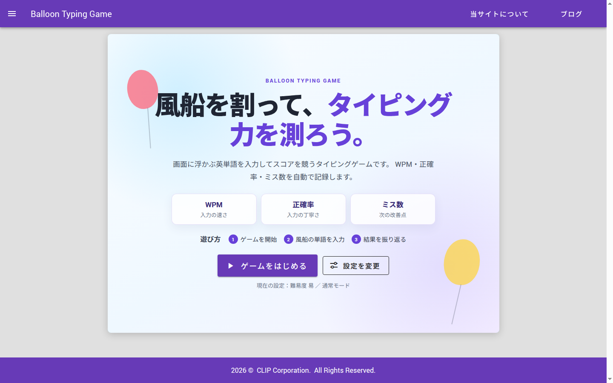
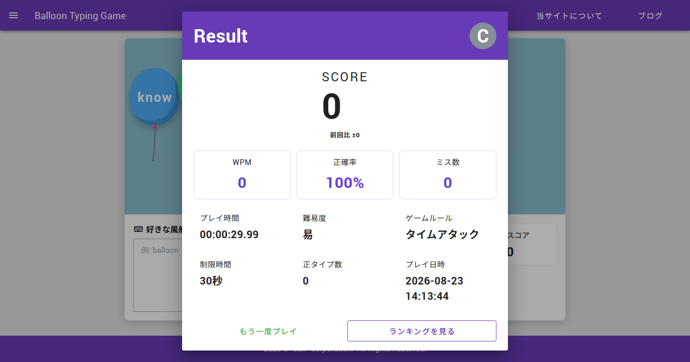
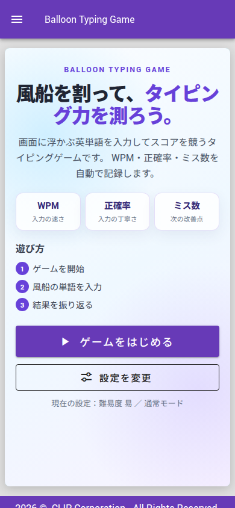

# Balloon Typing Game

Vue 3 + TypeScriptで作成した、風船を割っていくタイピングゲームです。

画面下から浮かび上がる風船型の単語を入力し、正しく打てると風船が破裂してスコアが加算されます。
プレイ後はWPM・正確率・ミス数・ランクを確認でき、同じ条件で遊んだ前回のスコアとも比較できます。

## ポートフォリオ概要

- Vue 3 / TypeScriptによるゲームUI、状態管理、レスポンシブ表示、Markdown技術ブログを実装しています。
- Spring Boot / MySQLのAPIをAWS EC2へ公開し、Nginx、HTTPS、JWT Bearer認証を使ってGitHub Pagesから接続しています。
- ロジックと主要コンポーネントを53ファイル・285テストで検証し、GitHub Actionsでformat・lint・typecheck・test・build・deployを自動化しています。

## リンク

- [Live Demo](https://juju351nicu.github.io/typingGame/)
- [Frontend Repository](https://github.com/juju351nicu/typingGame)
- [Backend Repository](https://github.com/juju351nicu/typing-game-backend)

## 技術ブログ

アプリ内にMarkdownの技術ブログ機能を実装し、開発中の設計判断と切り分けを記事として公開しています。

1. [GitHub PagesのVueからAWS EC2上のSpring Boot APIへHTTPS接続するまで](https://juju351nicu.github.io/typingGame/guide/ec2-spring-boot-https-frontend-connection)
   Ubuntu 24.04のEC2へSpring BootとMySQLを配置し、systemd、Nginx、Route 53、Let's Encryptでこのアプリの構成を組み立てるまで。`502 Bad Gateway` やSecurity Groupの設定漏れを、HTTPステータスからどう切り分けたのかも扱っています。
2. [Spring Security Resource ServerでJWT Bearer認証を実装する](https://juju351nicu.github.io/typingGame/guide/spring-security-jwt-resource-server)
   セッションCookieからJWT Bearer認証へ移行した理由と、OAuth2 Resource Serverを使った発行・検証の構成。トークンの保存先を `sessionStorage` にした判断とそのトレードオフまで書いています。
3. [Node.jsでMarkdownブログのposts-index.jsonを自動生成する](https://juju351nicu.github.io/typingGame/guide/nodejs-generate-posts-index)
   手動管理していた記事インデックスを、Markdownのfrontmatterを唯一の情報源として生成する形へ変えた設計。生成スクリプトをGitHub Actionsへ組み込み、更新漏れをCIで検知するまで扱っています。

上記以外を含む全12記事は[技術ブログ一覧](https://juju351nicu.github.io/typingGame/blogPostList)から参照できます。

## スクリーンショット

### ゲーム開始



### プレイ中


### リザルト・ランキング




### 技術ブログ


### スマホ表示



## 主な機能

### ゲーム

- 画面下から浮かぶ風船型の単語表示とタイピング判定
- 通常モード / タイムアタックモードと難易度設定
- 入力中の文字ハイライト、ミス入力時の強調、正解時の破裂アニメーション
- 学習補助用の仮想キーボード（次に打つキー、押したキー、ミスしたキーを表示）
- プレイ中の経過時間 / 残り時間 / スコア / ミス数表示

### リザルト・ランキング

- WPM / 正確率 / 正タイプ数 / ミス数 / ランクの計測
- 同条件で遊んだ前回スコアとの差分表示
- localStorageによるスコア履歴とローカルランキング
- ログインユーザーのスコアDB保存と、ユーザー別 / 全体ランキングの切り替え
- 直近5件のスコア / WPM / 正確率の推移表示

### アカウント・API

- ユーザー登録とJWT Bearer認証によるログイン
- API障害時もプレイ結果を失わないlocalStorage fallback
- バックエンドAPI無効時のフロントエンド単体動作

### UI

- スマホ幅まで対応したレスポンシブ表示
- ライト / ダークテーマ
- ARIA属性と `prefers-reduced-motion` 対応

### 技術ブログ

- Markdown記事の一覧・詳細表示（日付、セクション、技術タグ）
- 記事詳細の前後ナビゲーションと、本文からの関連記事リンク（SPA遷移）
- DOMPurifyによるMarkdown最終HTMLのサニタイズ

## 遊び方

1. デモURL、またはローカル環境でゲームを開きます。
2. `ゲームをはじめる` ボタンを押してゲームを開始します。
3. 画面に表示される風船の単語を入力します。
4. 正しく入力すると風船が破裂し、スコアが加算されます。
5. 通常モードでは、風船が画面上部まで到達するとゲーム終了です。
6. タイムアタックでは、設定した制限時間が0秒になるまでスコアを競います。
7. リザルト画面の `もう一度プレイ` ボタンから再挑戦できます。
8. 仮想キーボードは設定画面から任意で表示できます。

## 技術スタック

| 分類 | 技術 |
| --- | --- |
| Frontend | Vue 3, TypeScript, Vite, Vue Router, Pinia, Vuetify |
| Backend | Java 25, Spring Boot, Spring Security, JWT, JPA, Flyway |
| Database | MySQL 8.4, Docker Compose |
| Infrastructure | AWS EC2, Route 53, Nginx, Let's Encrypt, systemd |
| Test / CI/CD | Vitest, Vue Test Utils, ESLint, Prettier, vue-tsc, GitHub Actions, GitHub Pages |

## アーキテクチャ

```text
        GitHub Pages
   Vue 3 / TypeScript / Pinia
             │
             │  HTTPS + JWT Bearer
             ▼
      AWS EC2 (Ubuntu 24.04)
             │
        Nginx (リバースプロキシ / Let's Encrypt)
             │
        Spring Boot (systemd)
             │
        MySQL 8.4 (Docker Compose)
```

フロントエンドはGitHub Pagesの静的ホスティング、APIはEC2上のNginx経由でSpring Bootへ転送しています。
API停止中もゲーム、localStorage保存、ローカルランキング、技術ブログは動作します。

## 実装上の工夫

- ゲームロジックをComposition APIのcomposableへ責務ごとに分離し、コンポーネントは表示と接続に専念させています。
- `setInterval` のタイマーIDを管理し、`stopTimers` で画面遷移・ゲーム終了時に確実に停止させて多重起動を防いでいます。
- Spring Security Resource ServerによるJWT Bearer認証を実装し、有効期限を保存時刻から計算して期限切れトークンをAPI送信前に破棄しています。
- APIの送信先をURLのoriginで検証し、外部originへ `Authorization` ヘッダーを送らないよう制限しています。
- スコア保存をservice層へ分離し、常にlocalStorageへ保存したうえで、バックエンドAPI有効かつログイン時だけ `POST /api/me/scores` にも保存しています。
- `fetchClient` でHTTPエラーを共通例外として扱い、API保存・取得の失敗時もlocalStorageのプレイ結果と表示を維持しています。
- Markdown技術ブログを実装し、`posts-index.json` をfrontmatterから生成してGitHub Actionsで更新漏れを検知しています。
- Markdownから生成した最終HTMLをDOMPurifyでサニタイズし、XSS入力とリンク・画像保持をjsdom上の回帰テストで検証しています。
- ルート単位の遅延読み込みとMarkdown rendererの分割により、初期JSとblog chunkの肥大化を軽減しています。
- Vitestで53ファイル / 285テストを実装し、タイピング処理、タイマー、認証、API通信、スコア保存、ランキング、ブログ、ルーティング、設定復元、Markdownサニタイズ、コンポーネント表示を検証しています。

## コンポーネント設計

`TypingPanel.vue` に集まっていたゲーム処理を、Composition APIのcomposableとして責務ごとに分離しています。

| ファイル | 役割 |
| --- | --- |
| `useTypingGameWords.ts` | 表示中単語、出題インデックス、単語追加・削除・完了判定の管理 |
| `useTypingInput.ts` | 入力文字数、ミス数、ミス状態の算出 |
| `useTypingWords.ts` | 単語生成、文字ごとの正誤表示、入力状態クラスの生成 |
| `useTypingTimers.ts` | 単語追加・単語移動・破裂アニメーション用タイマーの管理 |
| `useTypingWordPositions.ts` | 風船の移動、画面上部到達判定 |
| `useTypingScore.ts` | 正解時のスコアと正タイプ数の加算値算出 |
| `useTimeAttackTimer.ts` | タイムアタックモードの残り時間と時間切れ処理の管理 |
| `useRankingPageState.ts` | ランキング画面のフィルター、集計、推移表示状態の管理 |
| `useMarkdownRenderer.ts` | Markdown本文のHTML変換、コードハイライト、DOMPurifyによる最終HTMLのサニタイズ |

上記は代表例です。ブログ、設定、テーマ同期などを含む全composableは `src/composables` を参照してください。

## 開発環境

Node.js 20.19.0以上を使用します。

```bash
npm install
npm run dev
```

バックエンドAPIと接続して起動する場合:

```bash
npm run dev:api
```

`dev:api` は `VITE_ENABLE_BACKEND_API=true`、`VITE_API_BASE_URL=http://localhost:8091`、`--port 8081`、`--strictPort` 付きで起動します。
`8081` が使用中の場合はポートを自動退避せず、CORS条件のズレに気づけるようエラーで停止します。

## 品質チェック

```bash
npm run check
```

`format:check`、`lint`、`typecheck`、`test`、`build` をまとめて実行します。

## ビルド

```bash
npm run build
```

## 技術ブログ記事の追加

```bash
npm run create-post
npm run generate:posts
```

`create-post` は `title`、`section`、`description`、任意の `tags` を入力するとfrontmatter付きの記事ファイルを作成します。
`blog_store/posts-index.json` はMarkdownのfrontmatterから自動生成するため、手動編集しません。

## デプロイ

Pull Requestでは、GitHub Actionsでブログインデックス、format、lint、typecheck、test、buildを確認します。
`master` ブランチへpushすると、同じ品質チェックの通過後にGitHub Pagesへ自動デプロイされます。

```text
generate:posts / check:posts
→ format:check
→ lint
→ typecheck
→ test
→ build
→ GitHub Pages deploy
```
