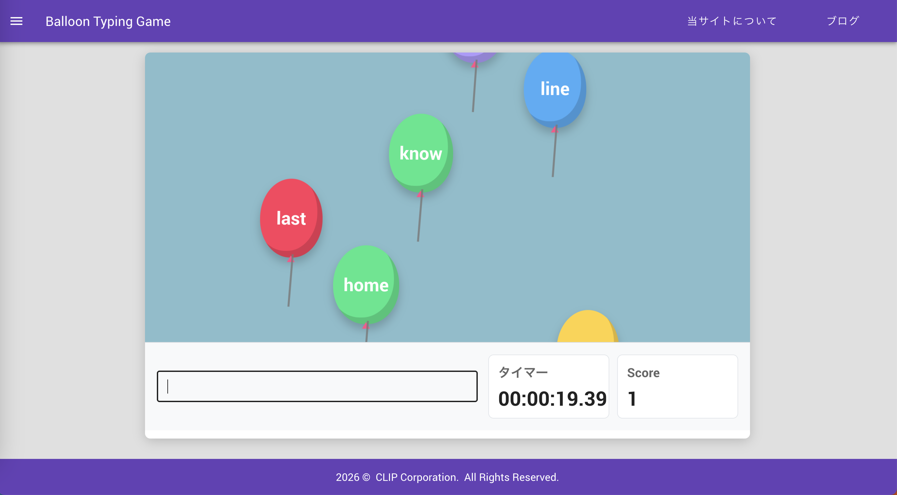

# Balloon Typing Game

Vue 3 + TypeScript で作成した、風船を割っていくタイピングゲームです。

画面下から浮かび上がる風船型の単語を入力し、正しく打てると風船が破裂してスコアが加算されます。

## Demo

[https://juju351nicu.github.io/typingGame/](https://juju351nicu.github.io/typingGame/)

## Screenshot



## Features

- 画面下から浮かぶ風船型の単語表示
- タイピング入力の正誤判定
- 入力中の文字ハイライト
- ミス入力時の強調表示
- 正解時の風船破裂アニメーション
- スコア表示
- リザルト画面
- WPM / 正確率 / ミス数の表示
- localStorage を使ったランキング表示
- 難易度設定
- スコア履歴の localStorage 保存
- GitHub Pages 自動デプロイ

## How to Play

1. デモURL、またはローカル環境でゲームを開きます。
2. `Play` ボタンを押してゲームを開始します。
3. 画面に表示される風船の単語を入力します。
4. 正しく入力すると風船が破裂し、スコアが加算されます。
5. 風船が画面上部まで到達するとゲーム終了です。

## Tech Stack

- Vue 3
- TypeScript
- Vite
- Vue Router
- Pinia
- pinia-plugin-persistedstate
- Vuetify
- Vitest
- GitHub Actions
- GitHub Pages

## Highlights

- `setInterval` のタイマーIDを管理し、多重起動を防止
- `stopTimers` を導入し、画面遷移やゲーム終了時にタイマーを確実に停止
- GitHub Pages のベースパスに対応し、公開環境でのページ遷移エラーを修正
- macOS と Linux のファイル名大文字小文字差異による build エラーを修正
- Pinia と localStorage を使い、設定とスコアを保持
- CSS アニメーションで、風船の浮遊と破裂演出を実装
- 入力中の風船を強調し、正しい文字・ミス文字を視覚的に判別しやすく改善
- ミス入力時に入力欄と風船へ短いフィードバックアニメーションを追加
- リザルト画面で WPM / 正確率 / ミス数 / ランクを表示
- ランキング画面でスコア、ランク、WPM、正確率、ミス数、難易度、タイムを比較可能に改善
- Vitest でユーティリティ関数、ランキング並び替え、スコア保存処理のテストを実装

## Development

```bash
npm install
npm run dev
```

Local URL:

```text
http://localhost:8081/
```

## Build

```bash
npm run build
```

## Test

```bash
npm run test
```

## Deployment

`master` ブランチへ push すると、GitHub Actions で build が実行され、GitHub Pages に自動デプロイされます。

Workflow:

1. `npm ci`
2. `npm run test`
3. `npm run build`
4. `dist` を GitHub Pages へデプロイ

## Roadmap

### Next

- UI/UX 改善
  - スマホ表示調整
  - ゲーム終了時の見やすさ改善
- テスト追加
  - スコア計算
  - localStorage 復元処理
  - ランキングフィルター

### Future

- 分析グラフ
  - スコア推移
  - WPM推移
  - 正確率推移
  - プレイ回数
  - 苦手キー
- Spring Boot API
  - スコア保存API
  - ランキング取得API
  - 成績一覧API
- JWTログイン
  - ユーザー登録
  - ログイン
  - ユーザー別スコア管理
- Docker / PWA
  - Docker Compose
  - オフライン対応
  - ホーム画面追加
